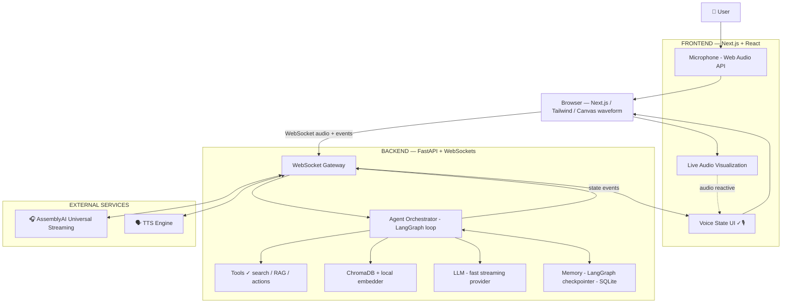
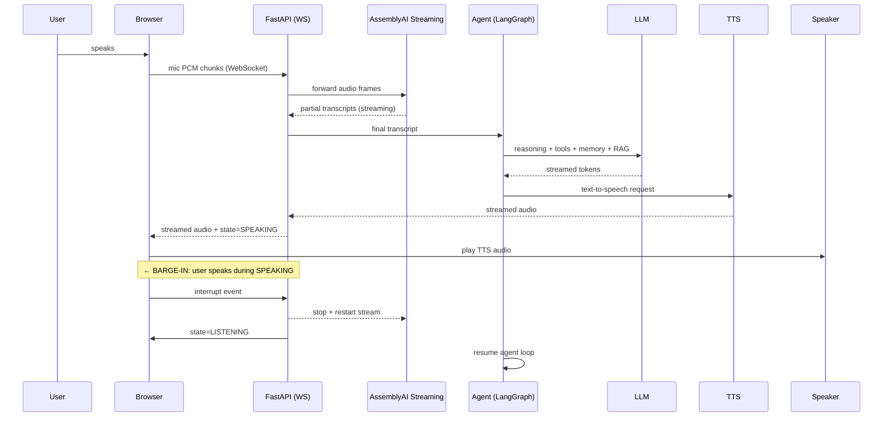
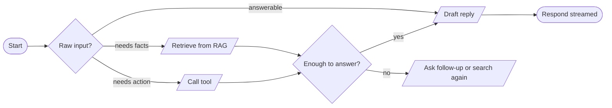
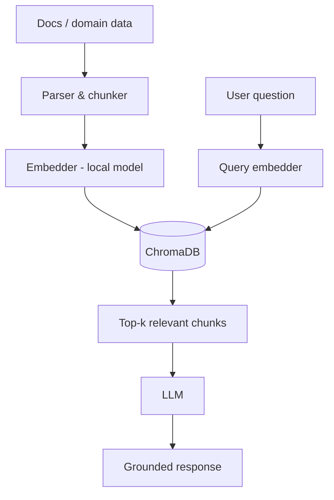
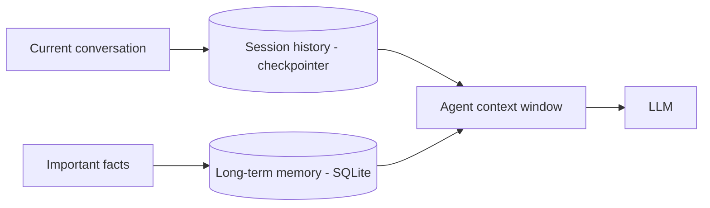
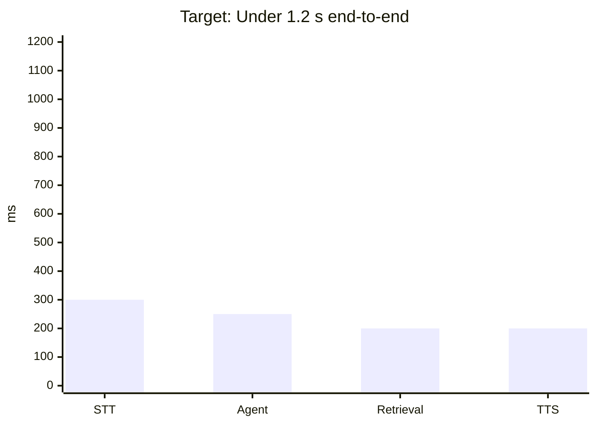

<div align="center">

# 🎙️ DataForge — Real-Time AI Voice Agent

### *A premium, real-time, agentic voice experience — built with free & open-source technologies.*

<br/>


-green)

<br/>

> **"Not another chatbot with a microphone. A real-time intelligent agent where
> voice is the primary interface."**

</div>

---

## 📑 Table of Contents

- [1. Project Overview](#1-project-overview)
- [2. Hackathon Information](#2-hackathon-information)
- [3. Problem Statement](#3-problem-statement)
- [4. Solution](#4-solution)
- [5. Why Voice?](#5-why-voice)
- [6. Key Features](#6-key-features)
- [7. Architecture](#7-architecture)
- [8. Voice Pipeline](#8-voice-pipeline)
- [9. Agent Logic](#9-agent-logic)
- [10. Tools / Function Calling](#10-tools--function-calling)
- [11. RAG (Knowledge Base)](#11-rag-knowledge-base)
- [12. Memory](#12-memory)
- [13. Technology Stack](#13-technology-stack)
- [14. UI / UX Design](#14-ui--ux-design)
- [15. Animation System](#15-animation-system)
- [16. Repository Structure](#16-repository-structure)
- [17. Installation](#17-installation)
- [18. Environment Variables](#18-environment-variables)
- [19. Local Development](#19-local-development)
- [20. API & WebSocket](#20-api--websocket)
- [21. Testing Strategy](#21-testing-strategy)
- [22. Security](#22-security)
- [23. Performance & Latency](#23-performance--latency)
- [24. Observability](#24-observability)
- [25. Development Roadmap (Sept 1–30, 2026)](#25-development-roadmap-sept-130-2026)
- [26. Hackathon Roadmap](#26-hackathon-roadmap)
- [27. Demo Scenario (2–3 min)](#27-demo-scenario-23-min)
- [28. Future Improvements](#28-future-improvements)
- [29. Team](#29-team)
- [30. License](#30-license)

---

## Status Legend

| Badge | Meaning |
| :---: | :--- |
| ✅ **IMPLEMENTED** | Confirmed present in the repository. |
| 🔨 **IN PROGRESS** | Actively being developed. |
| 🔮 **PLANNED** | Future work. Never presented as finished. |

> **Honesty rule:** this document clearly separates what exists from what is
> planned. Features marked 🔮 are *designed and scheduled* — not yet built.

---

## 1. Project Overview

**DataForge** is a real-time AI **Voice Agent** built during the
**AssemblyAI Voice Agent Hackathon** (September 2026). It combines:

- 🔴 **Real-time speech recognition** via AssemblyAI Universal-Streaming
- 🧠 **Agentic reasoning** (LLM + tools + memory + knowledge)
- 🎙️ **Premium voice-first UX** with live audio visualization and stateful mic UI
- ⚡ **Low-latency conversation loops** with turn detection and **barge-in** support

The product behaves like a real assistant: you *speak*, it *understands*,
*thinks*, answers, and can be **interrupted mid-sentence** — exactly like a
natural human conversation.

**Current status:** repository scaffolded (✅ docs, ✅ git). All application
features are 🔮 **PLANNED** and scheduled on the
[roadmap](#25-development-roadmap-sept-130-2026).

---

## 2. Hackathon Information

| | |
| :--- | :--- |
| **Event** | AssemblyAI Voice Agent Hackathon |
| **Organizer** | lablab.ai × AssemblyAI |
| **Dates** | September 1–30, 2026 |
| **Theme** | Real-Time Voice Agents |
| **Repository** | [`Melainin2/DataForge`](https://github.com/Melainin2/DataForge) |

---

## 3. Problem Statement

Voice assistants are everywhere, yet most are:

- **Turn-based and sluggish** — "speak → wait 10 s → hear a reply · repeat".
- **Passive** — they answer but don't *reason*, *remember*, or *use tools*.
- **Ugly** — terminal-style UIs that never feel like a product.
- **Locked in** to expensive, opaque cloud stacks.

Building a voice agent that *feels alive* — sub-second understanding, real-time
mid-sentence interruption, memory, knowledge retrieval, and tool use — is
genuinely hard, and almost everyone reaches for costly platforms.

**We set out to prove this can be done beautifully and almost entirely for free.**

---

## 4. Solution

DataForge is a **single, coherent voice product**:

- **Browser** captures mic audio (Web Audio API) and renders a living audio
  visualization.
- **FastAPI** backend opens a WebSocket, streams audio to **AssemblyAI** for
  real-time transcription, and orchestrates the **agent**.
- The **agent** reasons over *memory + retrieved knowledge (RAG)*, calls
  **tools**, and streams an answer that is **turned into speech** (TTS) and
  streamed back.
- The **UI** reflects live agent states (`IDLE → LISTENING → THINKING →
  SPEAKING`) with premium glassmorphism styling and meaningful animations.

---

## 5. Why Voice?

1. **Latency hides complexity.** With < 1 s round-trip understanding, the
   agent *feels* intelligent even when it is fast rather than omniscient.
2. **Interruption is the killer feature.** The ability to say *"wait, actually
   …"* mid-answer is what separates a demoware demo from true agent UX.
3. **Voice is the interface.** On a 2-minute demo, speech instantly reads as
   "modern AI product" to a non-technical judge — no UI tour required.
4. **Multi-modal potential.** The same pipeline can later visualize answers,
   open dashboards, or drive the browser with a tool.

---

## 6. Key Features

| # | Feature | Status |
| :-: | :--- | :-: |
| 1 | Real-time streaming speech recognition (AssemblyAI universal-streaming API) | 🔮 PLANNED |
| 2 | Low-latency agentic loop (LLM + tool calling) | 🔮 PLANNED |
| 3 | Conversational memory (short-term per session + long-term optional) | 🔮 PLANNED |
| 4 | RAG knowledge base (ChromaDB + local embeddings) | 🔮 PLANNED |
| 5 | Turn detection & **barge-in / interruption handling** | 🔮 PLANNED |
| 6 | Streaming TTS back to the browser | 🔮 PLANNED |
| 7 | Live audio waveform (Web Audio `AnalyserNode`, Canvas — no heavy lib) | 🔮 PLANNED |
| 8 | Animated voice states & glassmorphism dark UI | 🔮 PLANNED |
| 9 | Responsive design (desktop → mobile) with accessible voice controls | 🔮 PLANNED |
| 10 | Latency observability per pipeline stage | 🔮 PLANNED |
| 11 | `.env`-based secrets, never in frontend | ✅ IMPLEMENTED (policy documented) |
| 12 | Professional documentation & roadmap | ✅ IMPLEMENTED |

---

## 7. Architecture



**Key properties:** browser ↔ FastAPI over a single WebSocket; FastAPI ↔
AssemblyAI over a streaming bidirectional socket; agent decisions stay server-side
so keys never reach the client.

---

## 8. Voice Pipeline



**Turn detection** uses signal energy + AssemblyAI final/partial transcripts.
**Interruption** cancels current TTS playback client-side *and* terminates the
backend utterance so the agent re-enters `LISTENING`.

---

## 9. Agent Logic

The agent is a **graph-based loop** (LangGraph), fully controllable and
observable:



Every step asks three questions:

1. *Can I answer directly from context?* → reply.
2. *Do I need external information?* → RAG retrieval.
3. *Do I need to execute an action?* → tool call.

The loop runs until `ANSWER` — no more tool calls — then hands the text to TTS.

---

## 10. Tools / Function Calling

| Tool | Purpose | Status |
| :--- | :--- | :--- |
| `search_web` | Current-info lookups via a free search endpoint | 🔮 PLANNED |
| `rag_search` | Query the knowledge base with the top-k context | 🔮 PLANNED |
| `lookup_docs` | Fetch a specific document/chunk from the KB | 🔮 PLANNED |
| `remember / forget` | Explicit memory writes for long-term memory | 🔮 PLANNED |

**Design rule:** tools are opt-in — the agent decides when to use them, keeping
the core loop lean and the latency low.

---

## 11. RAG (Knowledge Base)



| Layer | Choice | Why (free-first) |
| :--- | :--- | :--- |
| Vector DB | **ChromaDB** | Open-source, local, zero-infra, persistent |
| Embeddings | **fastembed / sentence-transformers** (`all-MiniLM-L6-v2`) | Local & free — no API cost |
| Chunking | Recursive text splitter (~500 tokens, 15% overlap) | Simple, deterministic |

The agent is instructed to answer **only from the retrieved context** and to
say "I don't have that information" when a question is out of scope →
**hallucination control**.

---

## 12. Memory



- **Short-term memory:** automatic — the full session transcript is curated and
  re-injected via LangGraph checkpointer (SQLite, file-based, free).
- **Long-term memory:** explicit facts ("user's name…", recurring preferences)
  persisted and recalled in later sessions. *(Optional, keeps MVP simple.)*

---

## 13. Technology Stack

All choices follow the **Technical Decision Principle**: *necessary? free/open
source? improves the product? reduces complexity? improves latency? improves
the demo?*

| Layer | Technology | Cost | Rationale |
| :--- | :--- | :--- | :--- |
| Frontend | **Next.js 15** + React + TypeScript | Free | App Router, streaming SSR, HMR |
| Styling | **Tailwind CSS** + shadcn/ui + Lucide icons | Free | Fast, consistent, professional |
| Motion | **Motion (Framer Motion)** | Free | Declarative, performant animations |
| Audio capture | **Web Audio API** (`getUserMedia`) | Free | Native, zero deps |
| Audio visualization | Canvas + `AnalyserNode` | Free | Lightweight, reactive to real audio |
| Real-time layer | **WebSocket** | Free | Bidirectional, low overhead |
| Backend | **Python + FastAPI** | Free | Async, Pydantic, WebSocket-first |
| Agent framework | **LangGraph** | Free | Graph agent loop + memory checkpoints |
| LLM | Fast streaming provider (**Groq free tier**, OpenAI-compatible) | Free tier | Very low latency, generous free tier |
| STT | **AssemblyAI Universal-Streaming API** | Free tier | The hackathon's core requirement |
| TTS | Free/open TTS engine (e.g. Piper, Edge-TTS) | Free | Streamed speech without cloud cost |
| RAG | **ChromaDB** + fastembed local model | Free | Local, persistent, no server |
| Database | **SQLite** (via checkpointer) — Postgres/Supabase if scale needed | Free | Zero-config for MVP |
| Deployment | **Vercel** (frontend) + **Render** (backend) | Free tier | Documented below |
| Observability | Lightweight structured logs + per-stage latency metrics | Free | No paid monitoring |

> ⚠️ **Free-tier disclaimer:** free tiers are generous but can change.
> Availability is verified *at the time of deployment* — nothing is claimed
> here as guaranteed.

---

## 14. UI / UX Design

**Direction: Modern · Minimal · Futuristic · Professional · Voice-centric.**

```text
┌────────────────────────────────────────────────────┐
│ ◉ DataForge                 ● ONLINE      [API]   │
├────────────────────────────────────────────────────┤
│                                                    │
│                    AI VOICE AGENT                  │
│                                                    │
│                      ◉                             │
│                 ╱────────╲      ← animated states  │
│                                                    │
│        ~~~~~ ~~~~~ ~~~~~ ~~~~~  ← live waveform    │
│                                                    │
│                     Listening…                     │
│                                                    │
├────────────────────────────────────────────────────┤
│ Transcript                                          │
│   User    "What's the current context…"            │
│   Agent   "Based on the knowledge base…"           │
└────────────────────────────────────────────────────┘
```

**Visual system**

- Dark futuristic theme with **glassmorphism** panels (frosted blur + subtle border).
- **Subtle gradient accents** (indigo/violet) — never loud.
- **Glowing microphone** whose halo and pulse reflect state.
- Elegant typography, generous spacing, restrained motion.
- Fully **responsive**: the mic stays reachable on mobile.

### Voice States

| State | Visual representation |
| :--- | :--- |
| `IDLE` | Minimal microphone, dim ambient pulse |
| `LISTENING` | Mic glow + live waveform reacts to input |
| `THINKING` | Subtle AI "orbit" indicator, waveform settles |
| `PROCESSING` | Soft pulsing ring, low-key shimmer |
| `SPEAKING` | Waveform reacts to *output* audio |
| `ERROR` | Smooth but obvious red/shimmer state |

---

## 15. Animation System

Animations are **meaningful and performant** — never decorative clutter.

| Category | Technique |
| :--- | :--- |
| Page entrance | Fade + slide with `Motion` |
| Voice activation | Mic scale + glow (CSS + Motion) |
| Audio activity | Canvas waveform driven by `AnalyserNode` |
| Thinking | Subtle orbiting indicator |
| Speaking | Reactive waveform |
| Transcript | Messages fade/slide in |
| State transitions | Cross-fade keyed by `agentState` |
| Errors | Gentle shake + tint, never seizure-inducing |

**Performance rule:** all animations run on `transform`/`opacity` (GPU-friendly),
and the waveform loop pauses when no audio is active.

---

## 16. Repository Structure

```text
DataForge/
├── README.md                 # this document
├── .env.example              # secrets template (no real values)
├── .gitignore
├── frontend/                 # Next.js app
│   ├── app/
│   │   ├── page.tsx          # home / voice UI
│   │   └── layout.tsx
│   ├── components/
│   │   ├── VoiceVisualizer.tsx    # canvas waveform
│   │   ├── MicrophoneButton.tsx   # stateful mic
│   │   └── TranscriptPanel.tsx
│   ├── lib/
│   │   ├── ws.ts                  # websocket client
│   │   └── states.ts              # agent state machine
│   └── package.json
├── backend/                  # FastAPI app
│   ├── main.py               # websocket gateway
│   ├── agent/
│   │   ├── graph.py          # LangGraph loop
│   │   ├── tools.py          # tool registry
│   │   └── memory.py         # checkpointer wiring
│   ├── services/
│   │   ├── assemblyai.py     # streaming STT client
│   │   └── tts.py            # TTS client
│   ├── rag/
│   │   ├── ingest.py         # parse → chunk → embed
│   │   └── store.py          # ChromaDB wrapper
│   ├── tests/
│   └── requirements.txt
└── docs/
    └── architecture-diagram.md   # deeper dive (optional)
```

> 🔮 Structure target. Current repository contains only `README.md`.

---

## 17. Installation

### Prerequisites

- Python **3.11+**
- Node.js **20+** (LTS) and npm
- A microphone (desktop or mobile browser)
- Free API keys: **AssemblyAI**, your chosen **LLM provider**, optional TTS

### Steps

```bash
# 1. Clone
git clone git@github.com:Melainin2/DataForge.git
cd DataForge

# 2. Backend
cd backend
python -m venv .venv && source .venv/bin/activate
pip install -r requirements.txt
cp ../.env.example .env      # fill with your keys

# 3. Frontend
cd ../frontend
npm install
cp ../.env.example .env.local

# 4. Ingest knowledge base (optional, if RAG content is used)
python -m rag.ingest --docs ./knowledge
```

---

## 18. Environment Variables

> `.env.example` — **never commit real secrets.** No key is ever placed in
> frontend code; the browser only talks to our backend.

```env
# --- AssemblyAI ---
ASSEMBLYAI_API_KEY=

# --- LLM (OpenAI-compatible endpoint, e.g. Groq free tier) ---
LLM_API_KEY=
LLM_BASE_URL=
LLM_MODEL=
LLM_TEMPERATURE=0.3

# --- TTS ---
TTS_ENGINE=piper          # or edge-tts / elevenlabs-free
TTS_VOICE=

# --- RAG (local, no secret required) ---
CHROMA_PERSIST_DIR=./data/chroma

# --- Server ---
PORT=8000
FRONTEND_ORIGIN=http://localhost:3000
```

---

## 19. Local Development

```bash
# Backend (reload on save)
uvicorn backend.main:app --reload --port 8000

# Frontend
npm run dev
# open http://localhost:3000
```

Opening the page triggers the mic-consent flow, opens the WebSocket, and the
agent begins `LISTENING`.

---

## 20. API & WebSocket

**WebSocket endpoint:** `ws://localhost:8000/ws/voice`

| Direction | Message (JSON) | Purpose |
| :--- | :--- | :--- |
| Browser → Backend | `{"type":"audio","data":"<base64 pcm>"}` | Stream mic audio |
| Browser → Backend | `{"type":"interrupt"}` | Barge-in request |
| Backend → Browser | `{"type":"state","state":"LISTENING"}` | Agent state change |
| Backend → Browser | `{"type":"partial","text":"..."}` | Live transcript |
| Backend → Browser | `{"type":"final","text":"..."}` | Final transcript |
| Backend → Browser | `{"type":"audio","data":"<base64 mp3>"}` | Streamed TTS audio |
| Backend → Browser | `{"type":"latency","stt":..,"agent":..,"tts":..}` | Observability |
| Backend → Browser | `{"type":"error","message":"..."}` | Recoverable errors |

**Lifecycle:**
1. Client authenticates + requests `audio` channel.
2. Backend opens an AssemblyAI universal-streaming socket.
3. Mic PCM flows browser → backend → AssemblyAI; transcripts + states flow back.
4. On final transcript, the agent runs; TTS audio streams back; barge-in
   restarts this loop.

---

## 21. Testing Strategy

| Layer | What we test | Tooling |
| :--- | :--- | :--- |
| Voice | mic permissions, silence, background noise, interruption | Manual checklist + `pytest` fixture scripts |
| STT | API contract, reconnect, partial/final events | Mocked AssemblyAI client |
| Agent | intent, context, tool selection, hallucination-prevention prompts | `pytest` + prompt unit tests |
| RAG | retrieval quality, irrelevant/missing-info queries | Retrieval assertions on fixture docs |
| Backend | WebSocket errors, timeouts, reconnection | `pytest` + `httpx.ASGITransport`, `websockets` |
| UI | responsive, animations, a11y, loading states | Playwright + RTL |

---

## 22. Security

- Secrets live **only** in backend `.env`; AssemblyAI/LLM/TTS calls occur
  server-side.
- `.env.example` ships with placeholders; real `.env` is git-ignored.
- CORS restricted to the frontend origin.
- Input sanitization + transcript length limits to guard prompt-injection.
- No credit-card or UI login required for the MVP demo.

---

## 23. Performance & Latency

Latency budget targets (from mic to agent reply):



- **STT:** streaming partials arrive continuously — the agent can start reading
  intent from partial text.
- **Agent:** compact tool-graph; parallel RAG lookup; single-streamed LLM turn.
- **TTS:** streamed chunks — speech *starts* before generation completes.
- **Barge-in:** cancels playback instantly and resets to `LISTENING`.

**Rule:** no `await` on anything unnecessary; every rule-blocked response is
reported in the latency telemetry.

---

## 24. Observability

Lightweight, self-hosted, zero-cost:

- Per-stage latency counters emitted on every turn:
  `STT → agent → tool(s) → retrieval → TTS → total`.
- Structured JSON logs (`session_id`, stage, duration).
- Optional `/metrics` endpoint (Prometheus format) — **PLANNED**, only if time permits.
- Demo helper: a small "latency HUD" in the UI (dev-only) to *show* judges the
  pipeline working.

---

## 25. Development Roadmap (Sept 1–30, 2026)

> 🔮 All items are planned. Statuses will be flipped to ✅/In progress as work lands.

### WEEK 1 — MVP · *Goal: Working Voice Agent*

- [x] Clean repository, init git, professional README
- [ ] Verify architecture & document stack
- [ ] AssemblyAI universal-streaming integration
- [ ] Microphone capture (Web Audio API)
- [ ] Real-time transcription streaming
- [ ] Basic LLM turn
- [ ] Basic TTS response
- [ ] Basic frontend (mic button + transcript)

### WEEK 2 — AGENT · *Goal: chatbot → agent*

- [ ] Agent orchestration (LangGraph loop)
- [ ] Memory (checkpointer / conversation history)
- [ ] Tool calling (RAG search, web search)
- [ ] RAG ingest + retrieval pipeline
- [ ] Error handling & context management

### WEEK 3 — VOICE EXPERIENCE · *Goal: feels like a real voice agent*

- [ ] Streaming response path
- [ ] Turn detection (energy + partials)
- [ ] **Barge-in / interruption**
- [ ] Latency optimization pass
- [ ] Live audio visualization (waveform)
- [ ] Voice states + animations
- [ ] Responsive UI

### WEEK 4 — POLISH & SUBMISSION · *Goal: hackathon-ready product*

- [ ] UI polish & performance
- [ ] Security review & secrets hygiene
- [ ] Testing sweep (voice + agent + RAG + backend + UI)
- [ ] Production deployment (Vercel + Render)
- [ ] Demo scenario & demo script
- [ ] Demo video (screen + narration)
- [ ] README + architecture diagrams final pass
- [ ] Final submission to lablab.ai

---

## 26. Hackathon Roadmap

- **Strategy:** demonstrate **voice + real-time + agentic reasoning + tools +
  knowledge + memory + natural interaction + beautiful UX** in one demo.
- **Differentiator:** barge-in interaction and live audio visualization —
  two things a plain chatbot cannot do.
- **Submission assets:** README, architecture docs, demo video, and a live
  deployable URL (free tiers).

---

## 27. Demo Scenario (2–3 min)

```text
0:00  — Problem: assistants that make you wait.
0:20  — Introduce DataForge: "a voice agent, not a chatbot."
0:30  — User speaks naturally, no wake word.
0:50  — Agent understands mid-sentence (partial transcript visible live).
1:10  — Agent answers from the knowledge base / calls a tool.
1:30  — User interrupts: "wait, actually…"
1:45  — Agent stops, re-listens, adapts.
2:00  — Another capability: long-term memory ("you asked me this yesterday").
2:30  — Technical architecture (30-second diagram walkthrough).
2:50  — Final value pitch.
```

The demo is designed to show the *voice value* visually — the waveform, the
states, the interruption — not just a wall of text.

---

## 28. Future Improvements

- Multi-language support (AssemblyAI language codes)
- Streaming LLM-before-final + word-level partials for near-zero latency
- Supabase Postgres for cross-session long-term memory at scale
- Auth + per-user memory profiles
- Multi-agent team (specialist sub-agents behind one entry point)
- PWA + browser push for mobile parity

---

## 29. Team

| Role | Person |
| :--- | :--- |
| *(to be completed)* | — |

---

## 30. License

**MIT (planned).** A license will be attached before public submission —
decisions are tracked as an issue in this repository.

---

<div align="center">

**DataForge — where voice is the interface.** 🎙️✨

[⬆ Back to top](#-dataforge--real-time-ai-voice-agent)

</div>